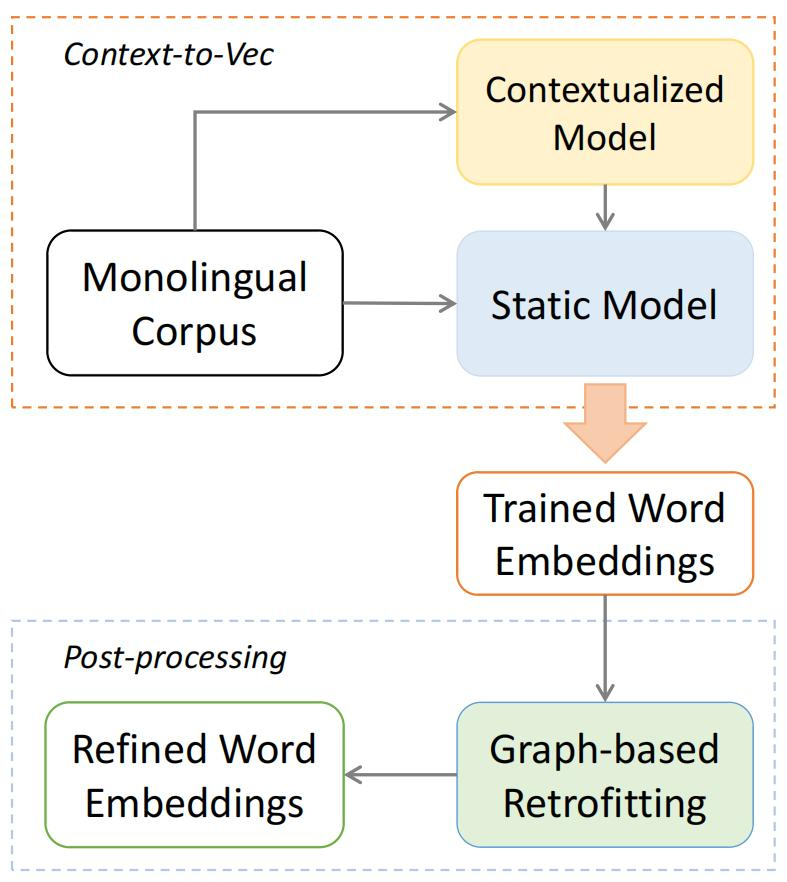
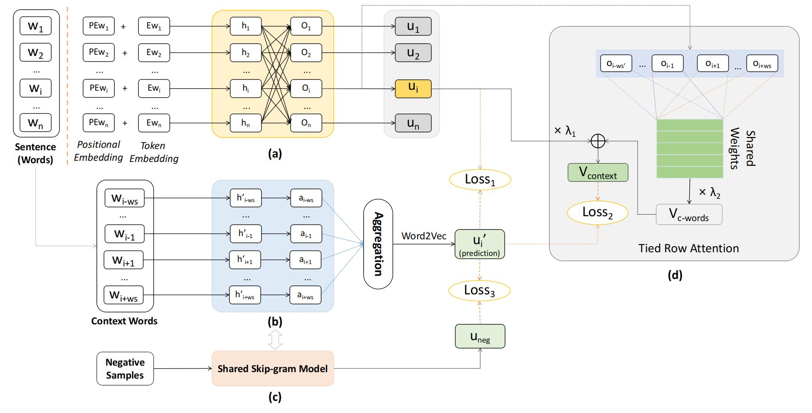

# Using Context-to-Vector with Graph Retrofitting to Improve Word Embeddings

This is the official code of the ACL 2022 paper *Intrinsic-Extrinsic Convolution and Pooling for Learning on 3D Protein Structures*.

## Overview
The overall training pipeline of our proposed word embeddings training and post-processing methods：


The Context2Vector model training framework:



## Citation

If you find this code useful please consider citing us:

BibTeX
```
@inproceedings{zheng2022using,
  title={Using Context-to-Vector with Graph Retrofitting to Improve Word Embeddings},
  author={Zheng, Jiangbin and Wang, Yile and Wang, Ge and Xia, Jun and Huang, Yufei and Zhao, Guojiang and Zhang, Yue and Li, Stan},
  booktitle={Proceedings of the 60th Annual Meeting of the Association for Computational Linguistics (Volume 1: Long Papers)},
  pages={8154--8163},
  year={2022}
}
```